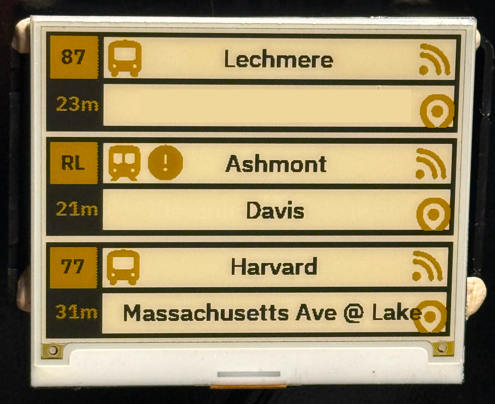

# inky-display

This is the display component of [inky-mbta-tracker](https://github.com/cubismod/inky-mbta-tracker).




## Required Components

* [Yellow Inky wHAT Display](https://shop.pimoroni.com/products/inky-what?variant=21441988558931).
  * Note: this is only yellow right now because I would have to change the colors otherwise to get red
  working. Black and white will not work.
* Compatible Raspberry Pi.
* Configured inky-mbta-tracker with its HTTP API reachable over the network.

## Setup

* Setting up your Pi & Inky wHAT is left to the reader.
* Create a `config.json` (or point at it with the `IMT_CONFIG` env var) based on
  `config.json.example`:

```json
{
  "api_url": "http://your_tracker_host:8080",
  "alerts_url": "https://api-v3.mbta.com/alerts",
  "show_alerts": true,
  "stops": [
    {
      "stop_id": "place-sstat",
      "route_filter": "",
      "direction_filter": -1,
      "transit_time_min": 15,
      "show_on_display": true
    }
  ]
}
```

* `alerts_url` points at the MBTA v3 alerts endpoint; it defaults to the
  official `https://api-v3.mbta.com/alerts`.
* `show_alerts` enables the hourly alert check (defaults to `true`).

### Alerts

Once an hour the display queries the MBTA v3 alerts API for active alerts
affecting the configured stops. If one exists, the alert header is shown for a
single refresh cycle before returning to departures.

Optional environment variables:

* `MBTA_API_KEY` — your MBTA v3 API key, sent as the `x-api-key` header to
  avoid IP-based rate limiting.
* `MBTA_ALERT_TEXT_ONLY=1` — debug mode that prints the alert header to stdout
  instead of drawing to the display; useful for testing without hardware.

* Create a virtual environment.
* Follow the I2C/SPI pre-req steps from the [inky GitHub library README](https://github.com/pimoroni/inky?tab=readme-ov-file#install-stable-library-from-pypi-and-configure-manually).
* Install [Taskfile](https://taskfile.dev/installation/) which is used in lieu of a Makefile.
* Run `task install-fonts` to install the required fonts to the `fonts/` directory.
* Run `task run` to watch the display.
